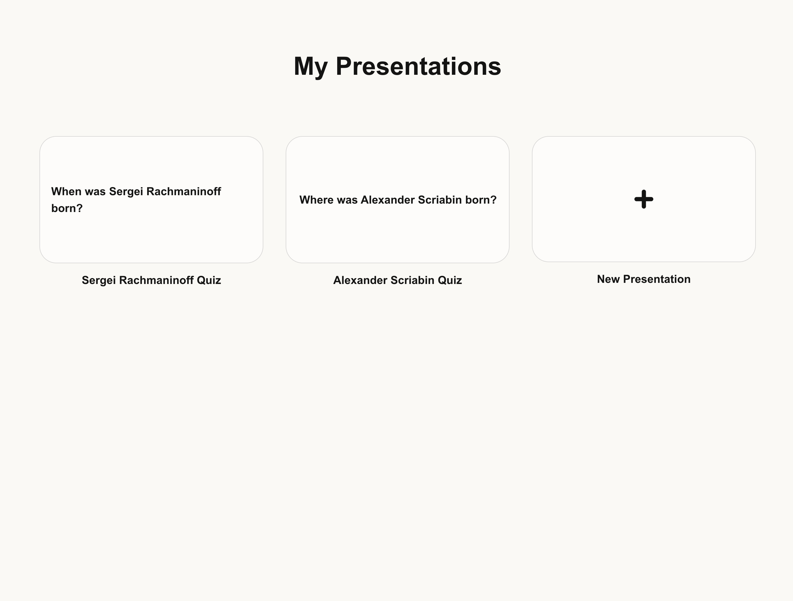
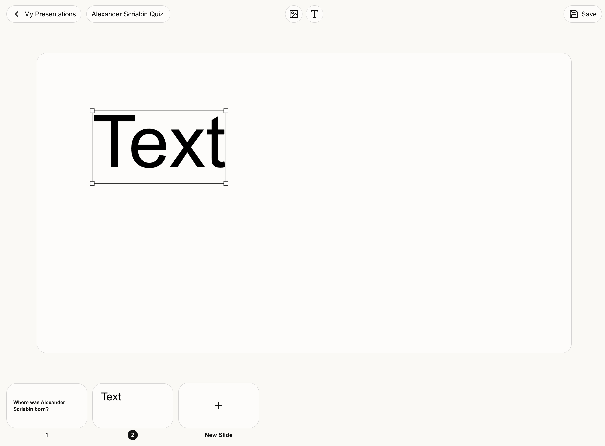

# Qwstion




## Requirements

- Node.js `v24.3.0`

## Getting Started

| Make sure you have a .env with `POSTGRES_URL`, `PRISMA_DATABASE_URL` and `DATABASE_URL` configured.

First, install all dependencies:

```bash
npm i
```

And then, run the development server:

```bash
npm run dev
```

## About the project

Qwstion is a slider editor that supports both free slide editing and interactive slides (at the moment it only supports **Multiple Choice** interactive slides).

This project was created using tools such as Next.js, Tailwind, Redux Toolkit, Konva, Prisma, PostgreSQL and Socket.IO.

## Architecture

- app
  - The folder structure follows Next.js routing structure, where the files inside the app folder defines the routing of the application.
  - All business related components are organized at the `_components` folders and redux store slices at `_store` folders. This facilitates refactorings, code reusability in other applications and prevents frequent file navigation as the project grows.
- ui
  - The UI folder contain reusable components with **no** business logic. This improves code reusability in other projects and the design experience.
- lib
  - This is the place for heavily reused code, such as helpers, hooks and service instances.
- pages
  - The folder structure follows Next.js routing structure. This is used exclusively for routing and controlling the REST Api.
- public
  - Mostly static files

| This project cannot be deployed on vercel, since it uses a custom server for Socket.IO support. Alternatives like SSEs are not optimal for this application use cases, so a custom server is necessary.
